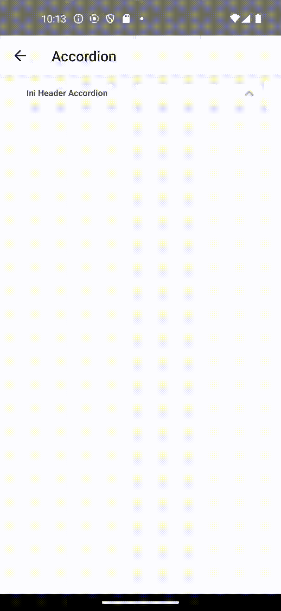

# 📂 Accordion

Komponen **Accordion** digunakan untuk menyembunyikan atau menampilkan konten secara dinamis. Biasanya digunakan untuk struktur seperti FAQ atau daftar konten bertingkat.


## 📦 USAGE

```tsx
import React from 'react';
import { Text } from 'react-native';
import Accordion from '@herca/ui-kit/Accordion';
import AccordionItem from '@herca/ui-kit/Accordion/AccordionItem';

export default function FAQSection() {
  return (
    <Accordion
      header={() => <Text style={{ fontWeight: 'bold' }}>Apa itu produk ini?</Text>}
      isOpen={false}
      onCollapse={(isOpen) => console.log('Status:', isOpen)}
    >
      <AccordionItem>
        Produk ini adalah solusi digital untuk kebutuhan bisnis Anda.
      </AccordionItem>
      <AccordionItem>
        Dapat digunakan di berbagai platform termasuk Android dan iOS.
      </AccordionItem>
    </Accordion>
  );
}

```


## Props

| props name           | mandatory | types   | default                                                  |
| -------------------- | --------- | ------- | -------------------------------------------------------- |
| header             |          | ReactNode | false                                            |
| isOpen              |         | boolean    |  true                                             |
| onCollapse              |         | (isOpen: boolean) => void	    |  true                                             |                         |

## Note

Komponen Accordion menggunakan state internal (useState) untuk mengatur apakah kontennya sedang terbuka atau tidak.

Fungsi header digunakan untuk merender tampilan judul Accordion dan dapat disesuaikan.

Konten yang disembunyikan/diperluas sebaiknya dibungkus dalam AccordionItem.