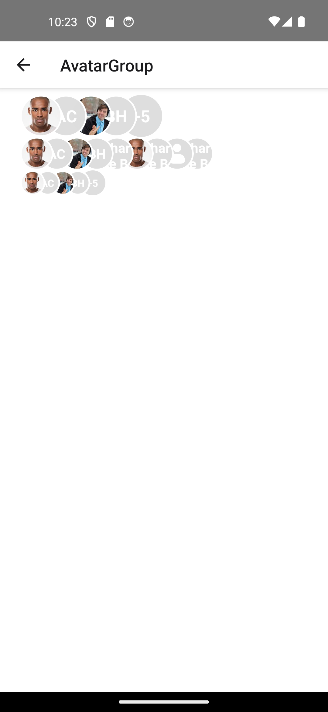

# AvatarGroup Component (React Native)

The `AvatarGroup` component displays a group of user avatars. It supports image avatars, initials-based avatars, and a fallback icon. If there are more avatars than the maximum visible count, it displays a "+X" bubble.

---

## 📦 Props

### `AvatarGroupProps`

| Prop         | Type                                | Default   | Description                                      |
|--------------|-------------------------------------|-----------|--------------------------------------------------|
| `avatars`    | `AvatarProps[]`                     | `[]`      | Array of avatar objects.                         |
| `maxVisible` | `number`                            | `5`       | Max number of avatars to display.                |
| `size`       | `'small' | 'medium' | 'large'`     | `'medium'` | Size of avatars.                                 |

### `AvatarProps`

| Prop            | Type                  | Description                                         |
|-----------------|-----------------------|-----------------------------------------------------|
| `size`          | `'small' | 'medium' | 'large'` | Size of individual avatar (optional).              |
| `source`        | `ImageSourcePropType` | Image source for avatar.                           |
| `name`          | `string`              | Initials to show if image is not available.        |
| `backgroundColor` | `string`            | Background color for initials or icon avatar.      |
| `textColor`     | `string`              | Color of the initials text.                        |
| `style`         | `object`              | Additional style for individual avatar container.  |

---

## 🖼️ Example Usage

```tsx
import AvatarGroup from './AvatarGroup';

const teamMembers = [
  { name: 'JS', backgroundColor: '#3498db' },
  { name: 'EM', source: require('./assets/emily.png') },
  { name: 'RS' },
  { name: 'AB', textColor: '#fff' },
  { name: 'ZK' },
  { name: 'XY' },
];

<AvatarGroup avatars={teamMembers} maxVisible={4} size="small" />
```

---

## 🎨 Avatar Sizes

| Size    | Dimension (px) |
|---------|----------------|
| small   | 30             |
| medium  | 40             |
| large   | 50             |

---
