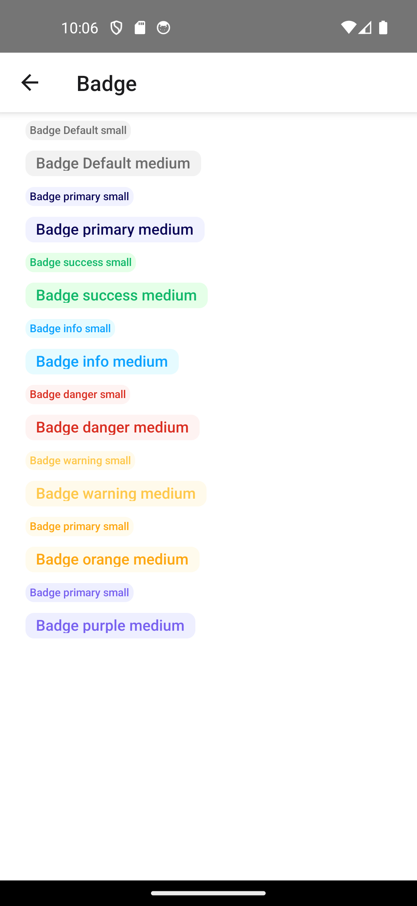

# 🔖 Badge Component

Komponen `Badge` digunakan untuk menampilkan label kecil yang memberikan informasi tambahan seperti status atau notifikasi.


## ✨ Fitur

- Mendukung warna varian seperti success, warning, danger, dll
- Dua ukuran tersedia: `small` dan `medium`
- Mode `dot` untuk hanya menampilkan titik status kecil
- Bisa menggunakan `children` untuk isi kustom atau gunakan `value` sebagai isi teks
 - Bisa menggunakan warna custom yang warna background nya menyesuaikan berdasarkan kode warna yang di inputkan ke props `color`

## 🧱 Props

| Prop       | Tipe                                 | Default     | Deskripsi                                                  |
|------------|--------------------------------------|-------------|------------------------------------------------------------|
| `value`    | `string \\| number \\| ReactNode`    | `undefined` | Nilai yang ditampilkan di badge jika `children` tidak ada |
| `color`    | `'default'` \\| `'primary'` \\| `...` \\| `#HEX`    | `'default'` | Warna badge, bisa menggunakan nama varian atau kode warna hex seperti `#FF0000`                                                |
| `size`     | `'small'` \\| `'medium'`             | `'medium'`  | Ukuran badge                                               |
| `dot`      | `boolean`                            | `false`     | Jika `true`, hanya menampilkan titik kecil                 |
| `children` | `React.ReactNode`                    | `undefined` | Jika ada, akan menggantikan `value` sebagai isi badge      |
| `rounded`  | `number`                             | `8`         | Jika di set, maka akan menambahkan border radius           |
| `gap`      | `number`                             | `0`         | Jika di set, maka akan menambahkan gap antar elemen        |

## 🎨 Warna default yang Tersedia

- `default`
- `primary`
- `success`
- `info`
- `warning`
- `danger`
- `orange`
- `purple`

## 📏 Ukuran Badge

| Ukuran | Tinggi | Font     | PaddingHorizontal | PaddingVertical | BorderRadius |
|--------|--------|----------|-------------------|------------------|---------------|
| small  | 18     | `t3`     | 4                 | 2                | 4             |
| medium | 24     | `t1`     | 10                | 4                | 8             |

## 📦 Contoh Penggunaan

```tsx
import React from 'react';
import Badge from './Badge'; // sesuaikan path

export default function Example() {
  return (
    <>
      {/* Badge dengan value */}
      <Badge color="success" value="Aktif" />

      {/* Badge dengan dot */}
      <Badge color="danger" dot />

      {/* Badge dengan children */}
      <Badge color="warning">
        <CustomComponent />
      </Badge>

      {/* badge dengan custom border radius */}
      <Badge 
        color="primary" 
        value="Aktif" 
        size="small" 
        rounded={5}
      />

      {/* badge dengan custom gap */}
      <Badge color="danger" size="small" gap={3}>
        <Icon name="Clock" size={10} color={Color.danger[500]} />
        <Typography variant="t3" color={Color.danger[500]}>
          Badge With Gap
        </Typography>
      </Badge>

      {/* badge dengan custom color */}
      <Badge
        color="#ba0b5c"
        size="small"
        gap={3}
        value="On Progress"
      />
    </>
  );
}

```