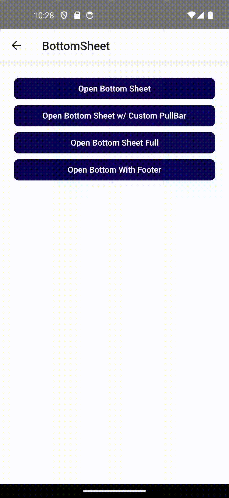

# ⬆️ BottomSheet Component

Komponen `BottomSheet` adalah modal bawah (slide-up) untuk menampilkan konten dinamis, form, konfirmasi, dll, dengan berbagai fitur interaktif seperti gesture drag, keyboard-aware, dan customizable height.


---

## 📦 Props

| Prop            | Tipe                             | Default     | Deskripsi                                                                 |
|------------------|----------------------------------|-------------|---------------------------------------------------------------------------|
| `isOpen`        | `boolean`                        | -           | Menentukan apakah bottom sheet sedang ditampilkan.                       |
| `onClose`       | `(isOpen: boolean) => void`      | -           | Callback saat bottom sheet ditutup.                                      |
| `children`      | `React.ReactNode`                | -           | Konten utama dari bottom sheet.                                          |
| `backdrop`      | `boolean`                        | `true`      | Menampilkan background semi-transparent.                                 |
| `closable`      | `boolean`                        | `true`      | Menentukan apakah bisa ditutup dengan drag atau klik di luar.            |
| `onRequestClose`| `(e: any) => void`               | -           | Dipanggil saat permintaan untuk menutup modal.                           |
| `buttonClose`   | `boolean`                        | `false`     | Menampilkan tombol X untuk menutup modal.                                |
| `height`        | `number \| string`               | `'auto'`    | Tinggi dari konten bottom sheet.                                         |
| `pullBar`       | `React.ReactNode`                | -           | Custom elemen untuk drag indicator.                                      |
| `footer`        | `React.ReactNode`                | -           | Menambahkan elemen tetap di bawah konten.                                |

---

## ✨ Fitur Unggulan

- Swipe-to-dismiss gesture (drag ke bawah)
- Keyboard aware (`KeyboardAvoidingView`)
- Responsif terhadap tampilan iOS dan Android
- `Animated.spring` untuk transisi yang halus
- Bisa dikontrol penuh lewat prop `isOpen`

---

## 📐 Contoh Penggunaan

---

```tsx
import React, { useState } from 'react';
import { Button, View } from 'react-native';
import BottomSheet from './BottomSheet';

export default function ExampleScreen() {
  const [open, setOpen] = useState(false);

  return (
    <View style={{ flex: 1 }}>
      <Button title="Buka Bottom Sheet" onPress={() => setOpen(true)} />

      <BottomSheet
        isOpen={open}
        onClose={() => setOpen(false)}
        label="Contoh Bottom Sheet"
        height="70%"
        buttonClose
      >
        <Text>Ini isi dari bottom sheet</Text>
      </BottomSheet>
    </View>
  );
}
```

