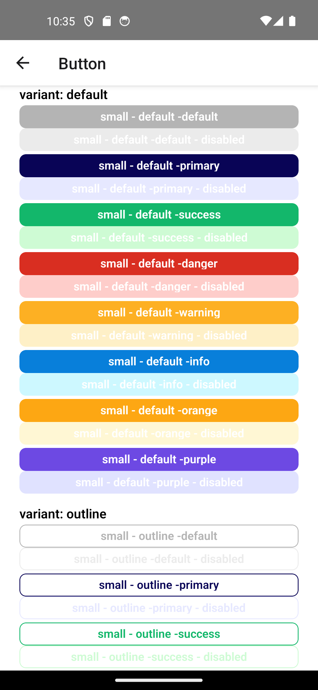

# 🔘 Komponen Button (React Native)

Komponen `Button` ini adalah tombol serbaguna untuk aplikasi React Native. Mendukung berbagai ukuran, varian, warna, dan status seperti `disabled` dan `loading`.


---

## 📌 Props

### ButtonProps

| Prop        | Tipe                                           | Default    | Deskripsi                                                                 |
|-------------|------------------------------------------------|------------|---------------------------------------------------------------------------|
| `children`  | `React.ReactNode`                              | -          | Elemen anak untuk konten tombol (opsional).                              |
| `title`     | `string | React.ReactNode`                     | -          | Teks yang ditampilkan pada tombol (jika `children` tidak digunakan).     |
| `onPress`   | `(event: GestureResponderEvent) => void`       | -          | Fungsi callback ketika tombol ditekan.                                   |
| `size`      | `'small' | 'medium' | 'large'`                  | `'medium'` | Ukuran tombol.                                                           |
| `variant`   | `'default' | 'outline' | 'tertiary'`            | `'default'`| Gaya tampilan tombol.                                                    |
| `color`     | `'default' | 'success' | 'danger' | 'primary' | 'warning' | 'info' | 'purple' | 'orange'` | `'default'`| Warna tombol.                    |
| `disabled`  | `boolean`                                      | `false`    | Menonaktifkan tombol jika `true`.                                        |
| `width`     | `number | string`                              | -          | Lebar tombol bisa dalam piksel atau persentase.                          |
| `block`     | `boolean`                                      | `false`    | Jika `true`, tombol akan penuh lebar (`width: 100%`).                    |
| `loading`   | `boolean`                                      | `false`    | Menampilkan indikator loading jika `true`.                               |

---

## 🎨 Ukuran Tombol

| Ukuran  | Padding Vertical | Padding Horizontal |
|---------|------------------|--------------------|
| small   | 6                | 12                 |
| medium  | 10               | 16                 |
| large   | 14               | 20                 |

---

## 🧪 Varian Tombol

- **default**: Tampilan tombol penuh warna dengan border.
- **outline**: Border saja, tanpa latar belakang.
- **tertiary**: Minimalis, tanpa border nyata.

---

## 🎨 Warna Tersedia

- `default`
- `success`
- `danger`
- `primary`
- `warning`
- `info`
- `purple`
- `orange`

---

## 🔄 Contoh Penggunaan

```tsx
import Button from './Button';

<Button
  title="Simpan"
  onPress={() => alert('Disimpan!')}
  size="large"
  color="primary"
  block
  loading={false}
/>

<Button
  title="Hapus"
  color="danger"
  variant="outline"
  onPress={() => alert('Dihapus!')}
/>
```

---

## 🧱 Struktur Direkomendasikan

```
/components
  ├── Button.tsx
  ├── Typography/
  ├── Color/
```

---

© 2025 – Komponen Tombol untuk UI React Native
