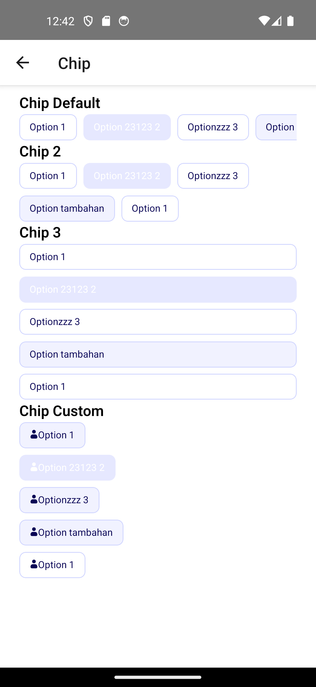

# 📦 Komponen `Chip` – React Native

Komponen `Chip` digunakan untuk menampilkan daftar pilihan seperti tag, filter, atau kategori dalam bentuk tombol kecil (chip). Komponen ini mendukung pilihan tunggal maupun jamak, arah horizontal/vertikal, dan gaya warna yang dapat disesuaikan.



---

## 🔧 Props

| Nama Props       | Tipe                                         | Default        | Deskripsi                                                                 |
|------------------|----------------------------------------------|----------------|--------------------------------------------------------------------------|
| `options`        | `ChipOption[]`                               | –              | Daftar opsi yang akan ditampilkan. Setiap opsi memiliki `label`, `value`, dan opsional `disabled`. |
| `selected`       | `string \| string[] \| null \| undefined` | `[]`           | Nilai yang dipilih. Bisa berupa string (single), array (multiple), atau null. |
| `onSelect`       | `(value: string \| string[]) => void`       | –              | Fungsi callback saat chip dipilih. Akan mengembalikan value terpilih. |
| `multiple`       | `boolean`                                    | `false`        | Jika `true`, bisa memilih lebih dari satu chip.                        |
| `direction`      | `'horizontal' \| 'vertical'`                | `'horizontal'` | Arah layout chip: horizontal (dalam baris) atau vertical (ke bawah).    |
| `scrollable`     | `boolean`                                    | `true` (horizontal) / `false` (vertical) | Apakah chip bisa digulir (scroll) saat melebihi lebar/tinggi.          |
| `block`          | `boolean`                                    | `false`        | Jika `true` dan `direction='vertical'`, maka chip akan memenuhi lebar kontainer (full width). |
| `color`          | `'default' \| 'success' \| 'danger' \| 'primary' \| 'warning' \| 'info' \| 'orange' \| 'purple'` | `'default'` | Warna tema chip.                                                         |
| `renderItem`     | `(item, isSelected, isDisabled) => ReactNode`| –              | Jika ingin custom tampilan chip secara manual.                          |

---

## 🧪 Contoh Penggunaan

### Single Select Horizontal (default)
```tsx
<Chip
  options={[
    { label: 'A', value: 'a' },
    { label: 'B', value: 'b' },
  ]}
  selected="a"
  onSelect={val => console.log(val)}
/>
```

### Multiple Select Vertical Block
```tsx
<Chip
  options={[
    { label: 'One', value: '1' },
    { label: 'Two', value: '2' },
  ]}
  selected={['1']}
  onSelect={val => console.log(val)}
  multiple
  direction="vertical"
  block
  scrollable={false}
/>
```

---

## 🎨 Warna yang Didukung

- `default`
- `success`
- `danger`
- `primary`
- `warning`
- `info`
- `orange`
- `purple`

---

## 📂 Tipe `ChipOption`

```ts
interface ChipOption {
  label: string;
  value: string;
  disabled?: boolean;
}
```

---

## 🧩 Catatan

- Jika `multiple = false`, maka `onSelect` mengembalikan satu string.
- Jika `multiple = true`, maka `onSelect` mengembalikan array string.
- `block` hanya berfungsi bila arah `vertical`.
- gunakan scrollable = false jika ingin membungkus di ScrollView
---

© 2025 – Komponen Chip by YourTeam