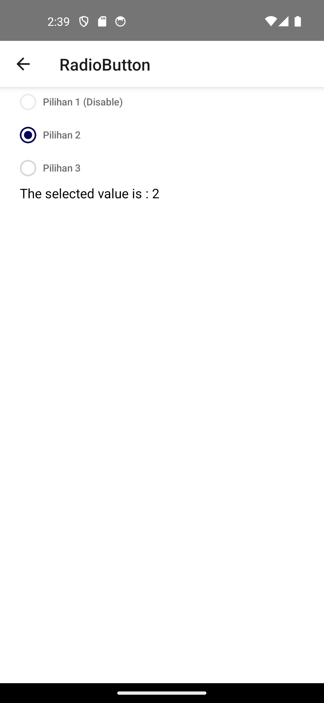

# 📦 RadioButton – Komponen React Native

Komponen `RadioButton` ini digunakan untuk menampilkan daftar pilihan dalam bentuk radio button di aplikasi React Native.


## 📄 Import

```tsx
import RadioButton from './RadioButton';
```

## ⚙️ Props

| Nama Props      | Tipe                                       | Default     | Deskripsi                                                                 |
|------------------|--------------------------------------------|-------------|---------------------------------------------------------------------------|
| `items`          | `RadioButtonItem[]`                        | -           | Daftar item radio yang ingin ditampilkan.                                |
| `selectedValue`  | `string \| null`                           | `null`      | Nilai yang saat ini dipilih oleh pengguna.                               |
| `onChange`       | `(value: string) => void`                  | -           | Fungsi callback saat item dipilih.                                       |
| `direction`      | `'vertical' \| 'horizontal'`               | `'vertical'`| Arah layout dari item radio: vertikal atau horizontal.                   |

## 📄 Tipe `RadioButtonItem`

```ts
interface RadioButtonItem {
  label: string;      // Teks yang ditampilkan untuk radio
  value: string;      // Nilai yang digunakan untuk identifikasi
  disabled?: boolean; // Menonaktifkan tombol radio
}
```

## 💡 Contoh Penggunaan

```tsx
<RadioButton
  items={[
    { label: 'Laki-laki', value: 'M' },
    { label: 'Perempuan', value: 'F' },
  ]}
  selectedValue={gender}
  onChange={setGender}
  direction="horizontal"
/>
```